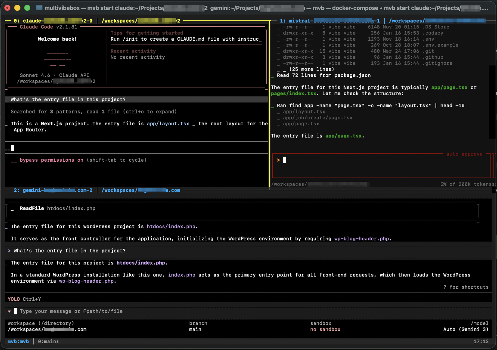

# Multivibebox

A Docker-based development environment that runs multiple CLI coding agents simultaneously in tmux panes. Ships with Claude Code, Gemini CLI, Mistral Vibe, and Codex ready to use. Built to handle multi-agent parallel coding and/or multiple projects across multiple agents.



## Features

- Work simultaneously with CLI AI coding agents
- Multi-project pane support
- Bind-mount local folders or clone from remote repos
- Git worktree isolation per agent
- Conversation persistence for all agents across restarts
- SSH agent forwarding for private repos
- macOS Keychain OAuth extraction for Claude Code
- Linux credentials file extraction
- API key authentication fallback
- Tmux pane navigation with mouse or keyboard
- Interactive branch merging
- Multi-terminal agent attachment/reattachment
- Audio notification + spoken pane number per pane
- Configurable notification threshold
- Docker volume workspaces
- Open container project files in host default editor via `mvb-open`
- Visual pane differentiation (checkerboard backgrounds, active pane highlighting)

## Supported Platforms

- **macOS**
- **Linux**
- **Windows** — requires [WSL 2](https://learn.microsoft.com/en-us/windows/wsl/install) with Docker Desktop configured to use the WSL 2 backend. Run all `mvb` commands from within your WSL terminal. Audio via `powershell.exe` using Windows system sounds.

You can also place custom `.wav` or `.ogg` files in the `sounds/` directory, named to match the `NOTIFY_SOUND` value in your agent config (e.g., `sounds/Glass.wav`).

## Architecture

```
┌─── macOS Host ───────────────────────────────────────────┐
│                                                           │
│  mvb (launcher script)                                    │
│    ├── docker compose up                                  │
│    └── host-watcher.sh (monitors notify/, plays sounds)   │
│                                                           │
│  ┌─── Docker Container ──────────────────────────────┐    │
│  │  tmux session "mvb"                               │    │
│  │  ┌──────────────┬──────────────┐                  │    │
│  │  │ claude       │ agent-2      │                  │    │
│  │  │ (pane 0)     │ (pane 1)     │                  │    │
│  │  ├──────────────┴──────────────┤                  │    │
│  │  │ agent-3 / status (pane 2)   │                  │    │
│  │  └─────────────────────────────┘                  │    │
│  │                                                   │    │
│  │  Claude Code hooks → writes to /notify             │    │
│  │                                                   │    │
│  │  Volumes:                                         │    │
│  │    /workspace  ← bind mount, volume, or git clone │    │
│  │    /home/vibe  ← named volume (all agent state)   │    │
│  │    /notify     ← bind mount (notification bridge) │    │
│  │    /open       ← bind mount (file-open bridge)    │    │
│  │    /config     ← bind mount (API keys, agent defs)│    │
│  └───────────────────────────────────────────────────┘    │
└───────────────────────────────────────────────────────────┘
```

## Prerequisites

- **macOS, Linux, or WSL 2** (see [Supported Platforms](#supported-platforms))
- **Docker Desktop** installed and running
- **jq** (`brew install jq` on macOS, `apt install jq` on Linux/WSL)
- An **[Anthropic API key](https://console.anthropic.com/settings/keys)** (for Claude Code)

## Quick Start

```bash
# 1. Clone the repo
git clone https://github.com/lytcode-llc/multivibebox.git
cd multivibebox

# 2. Install (symlinks mvb to PATH, builds Docker image)
make install

# 3. If you have a Claude Code subscription but don't have an API key, create your API key (get one at https://console.anthropic.com/settings/keys)
mvb config
# → Set ANTHROPIC_API_KEY=sk-ant-...

# 4. Start a project with a local folder (myproject argument is optional, defaults to directory or repo name). Uses Claude Code by default. If there are more than one agent in MVB_AGENTS, a pane for each agent opens with git worktree.
mvb start myproject --path ~/Projects/myproject

# Or clone a remote repo (uses SSH agent forwarding for private repos)
mvb start myproject --repo git@github.com:user/repo.git

# Or start multiple projects with your specific configured agents
mvb mvb start claude:~/Projects/project1 claude:~/Projects/project2

# 5. (Optional) Open another terminal and attach to a specific agent
mvb attach claude-0
```

## Usage

### Single-project mode

All panes share one workspace. Each pane gets a stable path (`/workspace-<agent>-<index>/`) for consistent conversation history.

```bash
# With a local folder (bind mount — edit in your IDE simultaneously)
mvb start myproject --path ~/Projects/myproject

# Clone a remote repo into a Docker volume (SSH agent forwarding for private repos)
mvb start myproject --repo git@github.com:user/repo.git

# Standalone (Docker volume), a pane for each config'd agent
mvb start myproject

# Multiple agents in parallel
mvb start myproject --path ~/Projects/myproject --agents claude,claude

# Shared mode (all agents in same directory, no worktrees)
mvb start myproject --path ~/Projects/myproject --shared
```

### Multi-project mode

Each pane gets its own project directory. Use `agent:path` pane specs:

```bash
# Two different projects, same CLI agents
mvb start claude:~/Projects/frontend claude:~/Projects/backend

# Two different projects, different CLI agents
mvb start gemini:~/Projects/frontend codex:~/Projects/backend

# Multiple panes on the same project + others, project name is auto-generated (frontend+frontend+api)
mvb start claude:~/Projects/frontend claude:~/Projects/frontend claude:~/Projects/api

# or you can set project name explicitly
mvb start myproject claude:~/Projects/frontend claude:~/Projects/backend
```

### Other commands

```bash
mvb stop                         # Stop container + host watcher
mvb list                         # List all projects (with status, agents, repo URL)
mvb attach                       # Attach to tmux session (interactive selection if multiple running)
mvb attach claude-0              # Attach to a specific pane by name
mvb merge                        # Interactive merge of agent worktree branches
mvb config                       # Edit .env in $EDITOR
mvb destroy myproject            # Remove project and its Docker volume
```

### Opening files from inside a container pane

Use `mvb-open` inside any agent pane to open a file in your host's default editor for that file type:

```bash
mvb-open path/to/file/index.ts
```

To select/copy a file path in an mvb pane on Mac: fn+Option click and drag, then Command+V to paste.

### Agent isolation modes

- **Worktree mode** (default for git repos): Each agent gets its own `git worktree` and branch (`agent/<agent>-<index>`). Use `mvb merge` to reconcile.
- **Shared mode** (`--shared`): All agents work in the same directory. Good for collaborative workflows.

### Conversation persistence

All agent state (conversation history, config, shell history) is persisted across container restarts via a Docker volume mounted at `/home/vibe`. When a Claude Code pane starts and prior conversation history exists for that workspace path, it automatically resumes with `--continue`. Other agents benefit from the same persistence for whatever state they store in the home directory.

## Audio Notifications

When an agent response takes longer than 30 seconds, you'll hear a system sound followed by a spoken announcement of the pane number (e.g., "pane 2"). Each agent can have its own sound. The threshold is configurable via `MVB_NOTIFY_MIN_DURATION`.

Text-to-speech uses `say` on macOS, `espeak`/`spd-say` on Linux, and PowerShell on WSL.

## Adding a Coding Agent

Gemini CLI (`gemini.conf`), Mistral Vibe (`mistral.conf`), and Codex (`codex.conf`) are included and ready to use.

To add your own agent:

1. Create a config file in `config/agents/`:

```bash
# config/agents/myagent.conf
AGENT_NAME="myagent"
AGENT_CMD="myagent-cli"
AGENT_ARGS="--some-flag"
AGENT_INSTALL="pip3 install myagent-cli"
NOTIFY_SOUND="Ping"
```

2. If the agent needs extra system packages, add them to the Dockerfile's agent install section.

3. Rebuild: `make build`

4. Use it: `mvb start myproject --agents claude,myagent`

### Available macOS sounds

Glass, Ping, Submarine, Tink, Pop, Purr, Hero, Blow, Bottle, Frog, Funk, Morse, Sosumi

## Configuration Reference

Edit `config/.env`:

| Variable | Default | Description |
|----------|---------|-------------|
| `ANTHROPIC_API_KEY` | — | Required for Claude Code |
| `OPENAI_API_KEY` | — | For OpenAI-based agents |
| `MVB_AGENTS` | `claude` | Comma-separated agent list (single-project mode) |
| `MVB_LAYOUT` | `tiled` | tmux layout (tiled, even-horizontal, even-vertical, main-horizontal, main-vertical) |
| `MVB_MAX_PANES` | `6` | Maximum number of agent panes |
| `MVB_NOTIFY_MIN_DURATION` | `30` | Minimum response time (seconds) before playing a notification sound |
| `MVB_NOTIFY_COOLDOWN` | `10` | Seconds between notification sounds per agent |

## Security

### Remote repo cloning

When using `--repo` to clone a remote repository, mvb applies protections against automatic code execution and warns about files that could influence agent behavior. Review any notices printed after cloning before trusting agent output.

Private repos authenticate via SSH agent forwarding. Your SSH keys never enter the container.

### Credentials

- API keys are stored in `config/.env` with owner-only permissions (600)
- OAuth tokens are passed via mounted secret files, not environment variables
- Agent install commands are restricted to known package managers (pip, npm, apt-get, brew, curl)

## Troubleshooting

### Docker not running
```
Error: Docker is not running. Please start Docker Desktop.
```
On macOS, `mvb start` will automatically launch Docker Desktop and wait for it to be ready. On Linux, start Docker manually and retry.

### No sound on notifications
- Check that `notify/` directory exists and is writable
- Verify the host watcher is running: `ps aux | grep host-watcher`
- Check macOS sound output is not muted

### Container can't find API key
- Make sure `config/.env` exists and has your key set
- Re-run `mvb config` to verify

### tmux session not attaching
- If the container is running but attach fails, try: `docker exec -it mvb-<project> tmux attach-session -t mvb`

### Can't detach session so you can run mvb commands?

In a new terminal window run $ docker kill $(docker ps -q --filter "name=mvb").
_or_
Close the terminal window containing mvb panes (don't worry about the warnings), launch new window and run $ mvb attach.

After either step..
$ mvb stop

## License

MIT
